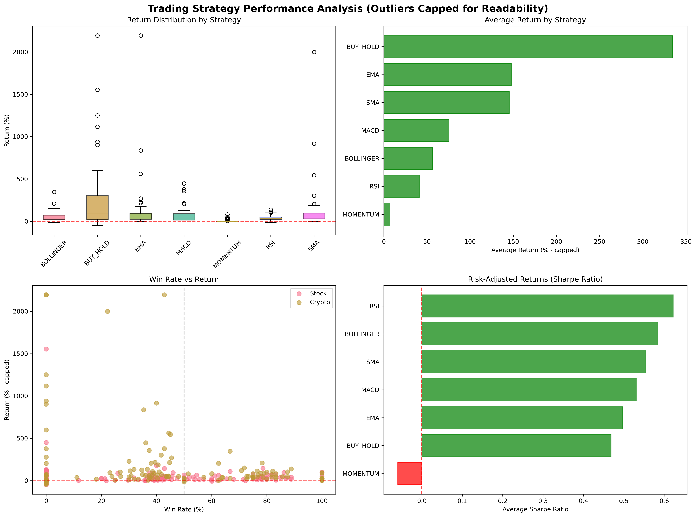
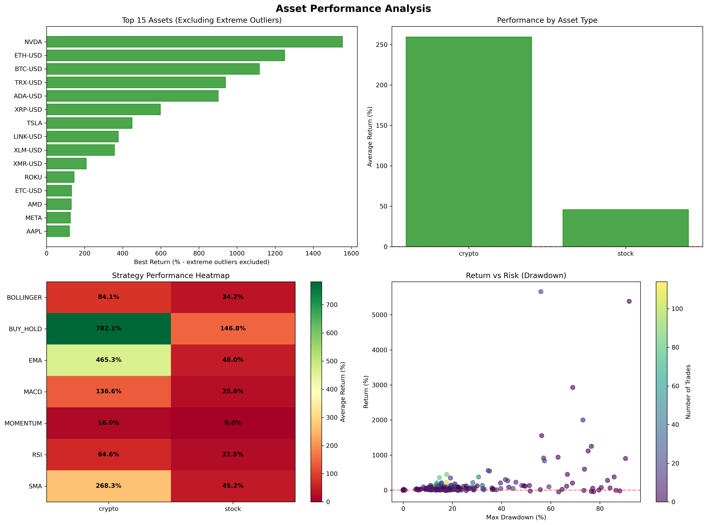
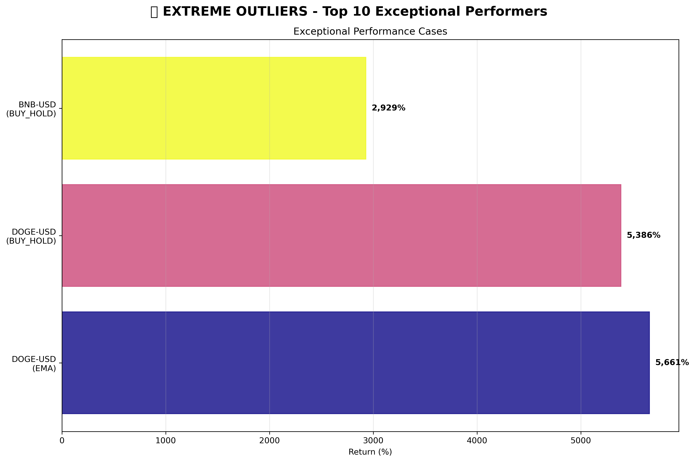
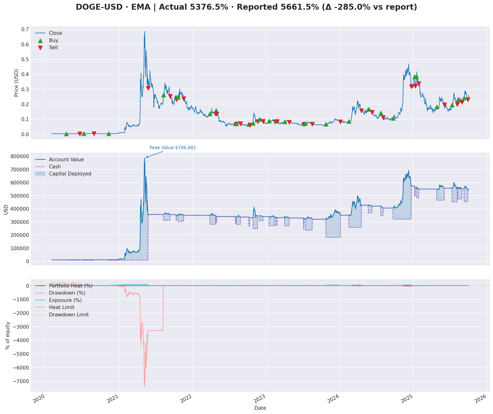
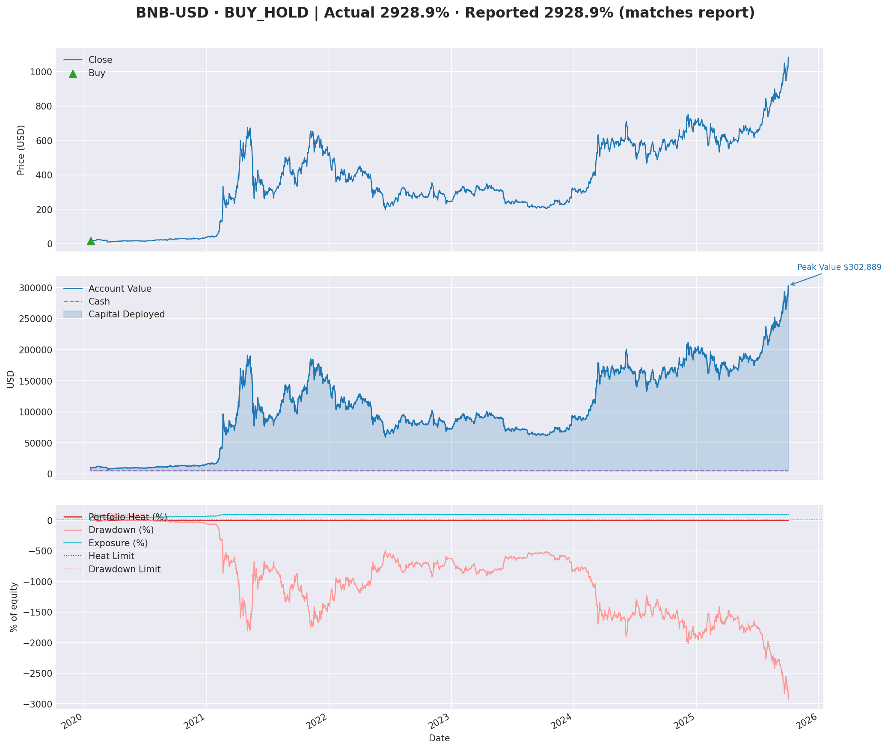
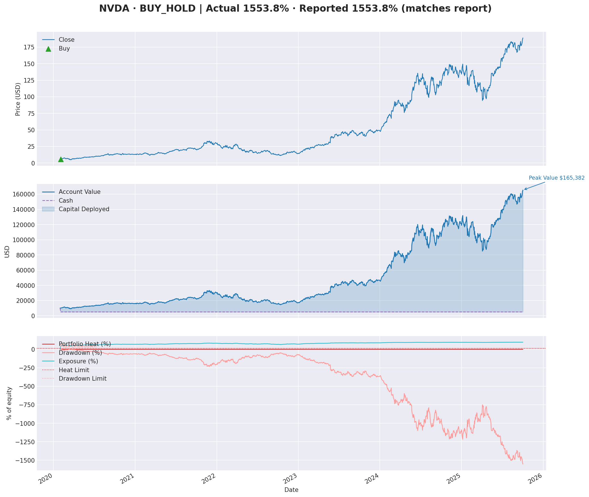

# Performance Report (2025-10-02T20:54:50.767658)

## Optimizer Run

- Symbols analysed: 41 (all)
- Strategies tested: 7
- Start date: 2020-01-01 | Cash per run: $10,000
- Parameter combinations: 10360
- Completed symbols: 40
- Failed symbols: SQ
- Command parameters: start_date=2020-01-01, cash=10000, symbols_type=all, risk_profile=aggressive, top_k=3, min_return=None

## Top Assets (Top 3)

| Rank | Symbol | Strategy | Return | Parameters |
| --- | --- | --- | --- | --- |
| 1 | DOGE-USD | EMA | 5,661.5% | EMA(short_period=15, long_period=30, risk_profile=aggressive) |
| 2 | BNB-USD | BUY_HOLD | 2,928.9% | BUY_HOLD(risk_profile=conservative) |
| 3 | NVDA | BUY_HOLD | 1,553.8% | BUY_HOLD(risk_profile=conservative) |

## Strategy Rankings

| Strategy | Avg Return | Best Symbol | Best Return |
| --- | --- | --- | --- |
| BUY_HOLD | 432.7% | DOGE-USD | 5,386.5% |
| EMA | 234.7% | DOGE-USD | 5,661.5% |
| SMA | 145.6% | DOGE-USD | 2,000.0% |
| MACD | 75.5% | XRP-USD | 445.6% |
| BOLLINGER | 56.7% | DOGE-USD | 345.9% |
| RSI | 41.4% | XMR-USD | 137.7% |
| MOMENTUM | 7.2% | BNB-USD | 79.8% |

## Buy & Hold Comparison

- Buy & Hold average return: 432.7%

## Visualisations

## Top Performer Timelines

## Source Data

- Optimisation JSON: multi_symbol_optimization_all_20251002_220143.json
